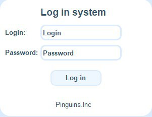
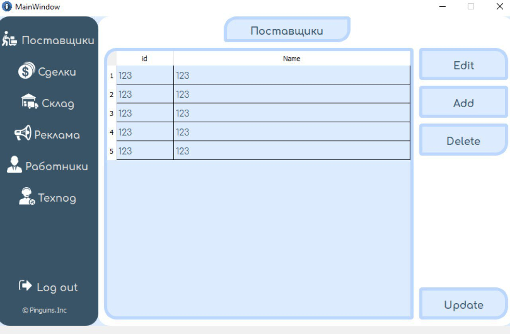

CRM система [](https://github.com/Plnguins/CRM/actions/workflows/linux-build.yml) [](https://github.com/Plnguins/CRM/actions/workflows/macos-build.yml) [](https://github.com/Plnguins/CRM/actions/workflows/windows-build.yml)
======

Проект для учебной практики в БГУИРе. 

## Введение ##
CRM (Costumer Relationship Management) - это система, помогающая выстраивать эффективные отношения между бизнесом и его клиентами. Успешное взаимодействие достигается за счет множества факторов: от учета заявок и сделок до автоматизации бизнес-процессов. 
CRM система, представленная в качестве проекта для учебной практики, специализируется на продаже ноутбуков.

## Структура приложения ##
| Раздел | Краткое описание |
| --- | --- |
| Поставщики | Организация работы с поставщиками |
| Сделки | Контроль сделок: учет времени, статуса заказа |
| Склад | Наличие техники на складе, ее цена |
| Реклама | Управление рекламой и анализ источников |
| Работники | Организация работы с сотрудниками компании |
| Техпод | При возникновении проблем можно обратиться в техподдержку |






## Основной функционал ##
 * Удобное взаимодействие с поставщиками.
 * Отслеживание статуса сделки.
 * Прогноз даты доставки заказа.
 * Контроль наличия и количества товаров на складе.
 * Отслеживание эффективности различных источников рекламы.
 * Управление сотрудниками компании, их данными.
 * Работа с финансами.
 * Осуществление техподдержки в случае проблем.

## Используемые технологии ##
 * C++
 * Qt6
 * PostgreSQL
 * Boost
 * SOCI
 * Git
 
## To Do ##
 * Использование микросервисной архитектуры для развития гибкости системы.
 * Внедрение API для упрощения поддержки приложения. Получится схема работы такой:
 ```mermaid
    sequenceDiagram
        App->>+Server: api/get-providers
        Server->>+Database: SELECT * FROM provider
        Database-->>-Server: 10 rows
        Server-->>-App: JSON response
 ```
 * Покрытие некоторых участков кода тестами.
 * Создание более подробной документации.
 * Адаптация приложения под другие ОС.
 * Оптимизация работы системы.
 * Расширение сферы применения CRM системы.
 * Внедрение алгоритмов ML для улучшения рекомендательной системы.
 
